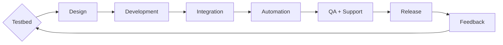
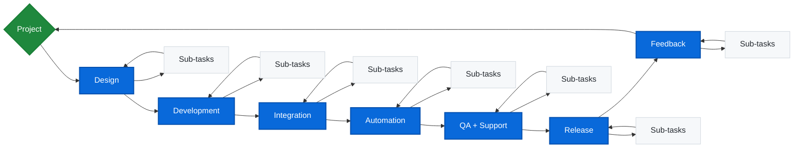

    
[**WORK TRACKER**](https://github.com/users/stephensmitchell/projects/4) • [**FORUM**](https://discord.gg/cC3PyMMyg8) • [**DISCORD**](https://discord.gg/cC3PyMMyg8) • [**YOUTUBE**](https://www.youtube.com/@stephensmitchell/featured)

> **Note:** Each named section below is a toggle panel. Click the ▸ or ▼ icon to **expand or collapse** content.
>
>  Most repositories are open source or source available, and closed to contributions.

# Development Process

<strong>Development Process [DRAFT]</strong>

### Planning
- What is the output supposed to be? What is the artifact, deliverable or tool to produce?
    - define inputs and outputs
    - research
- Gen-AI
    - Generate
        - Example/starter code
        - Ideas
    - Ask
        - What/if questions
        - How/why questions
    - Assistants
    - Chatbots
    - Agents

### Initial development
- Text editor and IDE use
- Evaluating solutions
    - reviewing inputs and outputs
    - finalizing requirements
- Gen-AI
    - Assistants
    - Chatbots
    - Agents

### Solution
- This is where the initial phases are brought together and the solution is made.

### Final output
- Output Types?
    - Artifact - anything that is produced or does something
        - e.g.
            - a file
            - any operation on a file or piece of data
            - any output
    - Tool - Anything that's made to be used to produce something that has a function with inputs and a final output.
        - e.g.
            - artifacts
            - anything with inputs and outputs
    - Deliverable - a package or collection of things, a set of output
        - e.g.
            - Artifacts
            - Tools
- Gen-AI
    - cleanup
    - logic review
    - improve error handling
    - reorganize
    - general refactoring without changing inputs and outputs
    - Assistants
    - Chatbots
    - Agents

# Design Process

# Public Work

<strong>Alibre</strong>

Primary source – [Alibre Forum](https://www.alibre.com/forum/index.php)

- [Audio Overview](https://www.notion.so/donetoolkit/Audio-Overview-23c5708902a0801a8860e9a26b9131ce?source=copy_link)  
- [Alibre Forum_ Stepalibre Posts_.pdf](https://github.com/user-attachments/files/21430840/Alibre.Forum_.Stepalibre.Posts_.pdf)  
- [Alibre.Forum_.Stepalibre.Posts_CORRECTION_MADE.pdf](https://github.com/user-attachments/files/21431354/Alibre.Forum_.Stepalibre.Posts_CORRECTION_MADE.pdf)  
- [Posts by @stepalibre on the Alibre User Forum.pdf](https://github.com/user-attachments/files/21431102/Posts.by.%40stepalibre.on.the.Alibre.User.Forum.pdf)  
- [User Profile Report_ __@stepalibre__ on the Alibre.pdf](https://github.com/user-attachments/files/21433535/User.Profile.Report_.__%40stepalibre__.on.the.Alibre.pdf)  
- [Forum Profile Analysis @stepalibre on Alibre Forums.pdf](https://github.com/user-attachments/files/21433902/Forum.Profile.Analysis.%40stepalibre.on.Alibre.Forums.pdf)

Repositories:  
- [alibre](https://github.com/stephensmitchell/alibre) – Dedicated add-ons and tools bundled for release.  
- [alibre-development](https://github.com/stephensmitchell/alibre-development) – Comprehensive source for development resources, starter projects, and tooling.  
- [alibre-programming](https://github.com/stephensmitchell/alibre-programming) – Alibre Script and AlibreX example code.  
- [AlibreScript](https://github.com/stephensmitchell/AlibreScript) – AlibreScript examples, demos, and experiments.  
- [alibre-script-adk](https://github.com/stephensmitchell/alibre-script-adk) – Alibre Script add-on developer kit.  
- [alibre-script-examples](https://github.com/stephensmitchell/alibre-script-examples) – Additional Alibre Script examples.  
- [alibre-script-library-examples](https://github.com/stephensmitchell/alibre-script-library-examples) – Library-focused examples.  
- [AlibreScript-documentation](https://github.com/stephensmitchell/AlibreScript-documentation) – AlibreScript API documentation and wiki.  
- [alibrex-documentation](https://github.com/stephensmitchell/alibrex-documentation) – AlibreX API documentation and wiki.  
- [alibre-logos](https://github.com/stephensmitchell/alibre-logos) – Source files for Alibre logos.  
- [GetInstalledAddons.Tool](https://github.com/stephensmitchell/GetInstalledAddons.Tool) – Utility for inspecting installed Alibre add-ons.  

- [AlibreScript-playground](https://github.com/stephensmitchell/AlibreScript-playground) – Browser-based code editor for AlibreScript.  
- [AlibreScript-vscode](https://github.com/stephensmitchell/AlibreScript-vscode) – VS Code extension for AlibreScript programming.  

<strong>Dynamo</strong>

- No public repositories listed.

<strong>Grasshopper</strong>

- No public repositories listed.

<strong>Rhino</strong>

- No public repositories listed.

<strong>Meshmixer</strong>

- [meshmixer-dotnet](https://github.com/stephensmitchell/meshmixer-dotnet)

<strong>Gmsh</strong>

- [gmsh-dotnet](https://github.com/stephensmitchell/gmsh-dotnet)

<strong>FreeCAD</strong>

- [freecad-dotnet](https://github.com/stephensmitchell/freecad-dotnet)

<strong>Blender</strong>

- [blender-dotnet](https://github.com/stephensmitchell/blender-dotnet)

<strong>Autodesk</strong>

- No public repositories listed.

<strong>Unity</strong>

- No public repositories listed.

<strong>Other Projects</strong>

- [system](https://github.com/stephensmitchell/system) – Required folder structure and data layout system.  
- [Extension](https://github.com/stephensmitchell/Extension)  
- [sgcore-docs](https://github.com/stephensmitchell/sgcore-docs) – Personal sgCore documentation site.  
- [stephensmitchell](https://github.com/stephensmitchell/stephensmitchell) – Profile repository.  

---

# Placeholders / Roadmap / Areas of Interest

<strong>Strategic and Development Focus[DRAFT]</strong>

- Design file and development project templates  
- CMS IntelliCAD  
- Autodesk Apps  
- Dynamo  
- Grasshopper  
- Rhino  
- Alibre Design  
- Solid Edge  
- SolidWorks  
- Excel  
- Blender  
- Houdini  
- MoI  
- Godot Engine  
- Unity  
- Unreal Engine  
- Marmoset Toolbag  
- Matlab/Octave  
- Open Cascade  
- SMath  
- MathCAD  
- QCAD  
- FreeCAD  
- macOS  
- Linux  
- Web  
- ThreeJS  
- BabylonJS  
- Processing  
- In Production  
- By Task  
- By Type  
- By Category  
- By Industry  
    - CGI  
    - Civil  
    - Architectural  
    - Structural  
    - Mechanical  
    - Fabrication  

---

# Databases

<strong>AI-Generated Content[DRAFT]</strong>

- Alibre Script and IronPython 2.7 Scripts Database for Alibre Design [ OFFLINE MODE | NEW SITE COMING SOON! ]
- .NET Programs and Add-Ons Database for Alibre Design [ OFFLINE MODE | NEW SITE COMING SOON! ]

---

# Tool-Building Tech. 

<strong>Testbed Overview[DRAFT]</strong>

**Testbed UI** → Data-driven, automation and scripting, plugin-based software for building CAD/CAE/CGI solutions. Testbed UI currently uses WPF and targets .NET Framework 4.8.1.

**Testbed Unity** → Tool and task development with integrated C# programming, visual programming, and user interface creation, supporting cross-platform deployment through Unity editor scripting APIs.

**Testbed CLI** → Integrated command-line and graphical interface. Testbed CLI is CLI-only and designed for broader automation.

Planned platform support: Windows 11, macOS (Apple Silicon), and Linux.

Evaluating **Eto Forms**, **Avalonia**, and **Uno Platform** for web, macOS, and Linux builds of Testbed UI & CLI. Testbed Unity, built in Unity, is inherently cross-platform.

---

# What is Testbed|Donetoolkit?

---

---

<strong>The Philosophy[DRAFT]</strong>

Testbed represents a development methodology where every aspect of a project or product is treated as a unified whole rather than separate stages or teams.  
It integrates exploration, R&D, QA, support, and testing throughout the product lifecycle—contrasting traditional sequential workflows. Complete transparency is the goal.

<strong>The Software[DRAFT]</strong>

Testbed also refers to the software platform itself, embodying the above philosophy and functioning as a comprehensive environment for the problem it is designed to solve.  
Source code, design assets, tests, prototypes, issues, and every resource that forms the solution are included and fully accessible to end users, except for proprietary or commercially licensed components. Developers may provide placeholder references for proprietary elements.

Due to restrictions and conflicts between commercial and open-source licensing, and the specific software and OS-level integration required, Testbed projects cannot be shared in uncompiled plaintext form.  
However, code examples can be provided on request, and contributions to public or private projects are possible when specific questions or issues arise.  
Base applications, templates, and plugin source code that do not rely on commercially licensed software or private IP will be made available.  
Repositories will contain only the application shell or default configuration, without CAD libraries, databases, plugins, or software integrations.  
The objective of sharing this work is collaboration—please reach out to connect.

