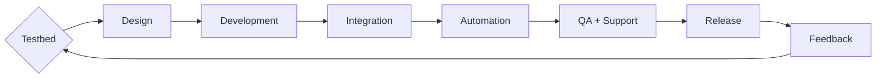
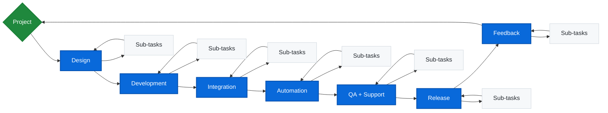

# Connect with Me

[**FORUM**](https://adk.discourse.group/invites/SLMLVC2fWV) • [**DISCORD**](https://discord.gg/utaaGsaX) • [**YOUTUBE**](https://www.youtube.com/@stephensmitchell/videos)

> **Note:** Each named section below is a toggle panel. Click the ▸ or ▼ icon to **expand or collapse** content.

<strong>Community & Support Channels</strong>

    
    - General help and technical discussions
    - Ideas and requests
    - Troubleshooting
    - GitHub projects and paid product support
    - If you want to build something at no cost, to sell, or for your business
    - Anything

# Public / Private Work

<strong>Alibre</strong>

Primary source – [Alibre Forum](https://www.alibre.com/forum/index.php)

- [Audio Overview](https://www.notion.so/donetoolkit/Audio-Overview-23c5708902a0801a8860e9a26b9131ce?source=copy_link)  
- [Alibre Forum_ Stepalibre Posts_.pdf](https://github.com/user-attachments/files/21430840/Alibre.Forum_.Stepalibre.Posts_.pdf)  
- [Alibre.Forum_.Stepalibre.Posts_CORRECTION_MADE.pdf](https://github.com/user-attachments/files/21431354/Alibre.Forum_.Stepalibre.Posts_CORRECTION_MADE.pdf)  
- [Posts by @stepalibre on the Alibre User Forum.pdf](https://github.com/user-attachments/files/21431102/Posts.by.%40stepalibre.on.the.Alibre.User.Forum.pdf)  
- [User Profile Report_ __@stepalibre__ on the Alibre.pdf](https://github.com/user-attachments/files/21433535/User.Profile.Report_.__%40stepalibre__.on.the.Alibre.pdf)  
- [Forum Profile Analysis @stepalibre on Alibre Forums.pdf](https://github.com/user-attachments/files/21433902/Forum.Profile.Analysis.%40stepalibre.on.Alibre.Forums.pdf)

Repositories:  
- [alibre-addon-registry-tool](https://github.com/stephensmitchell/alibre-addon-registry-tool)  
- [alibre-adk-testbed](https://github.com/stephensmitchell/alibre-adk-testbed)  
- [alibre-assimp-addon](https://github.com/stephensmitchell/alibre-assimp-addon)  
- [alibre-cpp-addon-template](https://github.com/stephensmitchell/alibre-cpp-addon-template)  
- [alibre-cpp-addon-template-2](https://github.com/stephensmitchell/alibre-cpp-addon-template-2)  
- [alibre-design-explorer-refresh-tool](https://github.com/stephensmitchell/alibre-design-explorer-refresh-tool)  
- [alibre-dynamo-addon](https://github.com/stephensmitchell/alibre-dynamo-addon)  
- [alibre-excel-addon](https://github.com/stephensmitchell/alibre-excel-addon)  
- [alibre-export-addon](https://github.com/stephensmitchell/alibre-export-addon)  
- [alibre-feature-naming-addon](https://github.com/stephensmitchell/alibre-feature-naming-addon)  
- [alibre-fillet-r-and-d](https://github.com/stephensmitchell/alibre-fillet-r-and-d)  
- [alibre-freecad-addon](https://github.com/stephensmitchell/alibre-freecad-addon)  
- [alibre-function-libraries](https://github.com/stephensmitchell/alibre-function-libraries)  
- [alibre-gh-addon](https://github.com/stephensmitchell/alibre-gh-addon)  
- [alibre-HOOPS-addon](https://github.com/stephensmitchell/alibre-HOOPS-addon)  
- [alibre-lab-addon](https://github.com/stephensmitchell/alibre-lab-addon)  
- [alibre-logos](https://github.com/stephensmitchell/alibre-logos)  
- [alibre-multi-target-template](https://github.com/stephensmitchell/alibre-multi-target-template)  
- [alibre-nocode-addon](https://github.com/stephensmitchell/alibre-nocode-addon)  
- [alibre-nodes-addon](https://github.com/stephensmitchell/alibre-nodes-addon)  
- [alibre-preset-system-demo](https://github.com/stephensmitchell/alibre-preset-system-demo)  
- [alibre-programming](https://github.com/stephensmitchell/alibre-programming)  
- [alibre-python-shell-addon](https://github.com/stephensmitchell/alibre-python-shell-addon)  
- [alibre-script](https://github.com/stephensmitchell/alibre-script)  
- [alibre-script-adk](https://github.com/stephensmitchell/alibre-script-adk)  
- [alibre-script-adk-addon-template](https://github.com/stephensmitchell/alibre-script-adk-addon-template)  
- [alibre-script-examples](https://github.com/stephensmitchell/alibre-script-examples)  
- [alibre-script-library-examples](https://github.com/stephensmitchell/alibre-script-library-examples)  
- [alibre-script-runner](https://github.com/stephensmitchell/alibre-script-runner)  
- [alibre-script-runner-addon](https://github.com/stephensmitchell/alibre-script-runner-addon)  
- [alibre-scripting-addon](https://github.com/stephensmitchell/alibre-scripting-addon)  
- [alibre-shapes-addon](https://github.com/stephensmitchell/alibre-shapes-addon)  
- [alibre-sketch-function-library](https://github.com/stephensmitchell/alibre-sketch-function-library)  
- [alibre-skinning-addon](https://github.com/stephensmitchell/alibre-skinning-addon)  
- [alibre-stltostp-addon](https://github.com/stephensmitchell/alibre-stltostp-addon)  
- [alibre-testbed-addon](https://github.com/stephensmitchell/alibre-testbed-addon)  
- [alibre-vscodium-addon](https://github.com/stephensmitchell/alibre-vscodium-addon)

<strong>Autocad</strong>

- [autodesk-scripting-plugins](https://github.com/stephensmitchell/autodesk-scripting-plugins)

<strong>Blender</strong>

- [blender-export-tool](https://github.com/stephensmitchell/blender-export-tool)  
- [blender-dotnet](https://github.com/stephensmitchell/blender-dotnet)

<strong>Dynamo</strong>

- [dynamo-scripting-plugin](https://github.com/stephensmitchell/dynamo-scripting-plugin)

<strong>Excel</strong>

*(no linked projects yet)*

<strong>FreeCAD</strong>

- [freecad-export-tool](https://github.com/stephensmitchell/freecad-export-tool)  
- [freecad-dotnet](https://github.com/stephensmitchell/freecad-dotnet)

<strong>Grasshopper</strong>

- [grasshopper-scripting-plugin](https://github.com/stephensmitchell/grasshopper-scripting-plugin)

<strong>Gmsh</strong>

- [gmsh-dotnet](https://github.com/stephensmitchell/gmsh-dotnet)

<strong>Meshmixer</strong>

- [meshmixer-dotnet](https://github.com/stephensmitchell/meshmixer-dotnet)

<strong>Intellicad</strong>

*(no linked projects yet)*

<strong>Inventor</strong>

*(no linked projects yet)*

<strong>Revit</strong>

*(no linked projects yet)*

<strong>Rhino</strong>

- [rhino-scripting-plugin](https://github.com/stephensmitchell/rhino-scripting-plugin)

<strong>Solid Edge</strong>

*(no linked projects yet)*

<strong>SolidWorks</strong>

*(no linked projects yet)*

<strong>Unity</strong>

- [unity-cad-management-package](https://github.com/stephensmitchell/unity-cad-management-package)  
- [unity-cad-manager](https://github.com/stephensmitchell/unity-cad-manager)

<strong>Other Projects</strong>

- [stephensmitchell](https://github.com/stephensmitchell/stephensmitchell) (profile repository)  
- [AlibreBOM](https://github.com/stephensmitchell/AlibreBOM)  
- [AlibreExportOpen](https://github.com/stephensmitchell/AlibreExportOpen)  
- [AnimationAddOn-Updated](https://github.com/stephensmitchell/AnimationAddOn-Updated)  
- [AnimationSampleAddOn](https://github.com/stephensmitchell/AnimationSampleAddOn)  
- [BaseAddon-addon](https://github.com/stephensmitchell/BaseAddon-addon)  
- [cad-programming-templates](https://github.com/stephensmitchell/cad-programming-templates)  
- [cppAddons](https://github.com/stephensmitchell/cppAddons)  
- [CycloidalGear](https://github.com/stephensmitchell/CycloidalGear)  
- [DataBrowserForAlibre](https://github.com/stephensmitchell/DataBrowserForAlibre)  
- [DXSampleAddOn](https://github.com/stephensmitchell/DXSampleAddOn)  
- [DXSampleAddOn-Updated](https://github.com/stephensmitchell/DXSampleAddOn-Updated)  
- [GearCalculator](https://github.com/stephensmitchell/GearCalculator)  
- [genai-chat-logs](https://github.com/stephensmitchell/genai-chat-logs)  
- [IIconss](https://github.com/stephensmitchell/IIconss)  
- [resources](https://github.com/stephensmitchell/resources)  
- [SelectionAddon](https://github.com/stephensmitchell/SelectionAddon)  
- [SelectionAddOnSample-Updated](https://github.com/stephensmitchell/SelectionAddOnSample-Updated)  
- [SelectionSampleAddOn](https://github.com/stephensmitchell/SelectionSampleAddOn)  
- [sgcore-docs](https://github.com/stephensmitchell/sgcore-docs)  
- [SimpleCppAddon](https://github.com/stephensmitchell/SimpleCppAddon)  
- [SimpleCppAddon-code](https://github.com/stephensmitchell/SimpleCppAddon-code)  
- [UtilitiesForAlibre](https://github.com/stephensmitchell/UtilitiesForAlibre)

---

# Placeholders / Roadmap / Areas of Interest

<strong>Strategic and Development Focus</strong>

- Design file and development project templates  
- CMS IntelliCAD  
- Autodesk Apps  
- Dynamo  
- Grasshopper  
- Rhino  
- Alibre Design  
- Solid Edge  
- SolidWorks  
- Excel  
- Blender  
- Houdini  
- MoI  
- Godot Engine  
- Unity  
- Unreal Engine  
- Marmoset Toolbag  
- Matlab/Octave  
- Open Cascade  
- SMath  
- MathCAD  
- QCAD  
- FreeCAD  
- macOS  
- Linux  
- Web  
- ThreeJS  
- BabylonJS  
- Processing  
- In Production  
- By Task  
- By Type  
- By Category  
- By Industry  
    - CGI  
    - Civil  
    - Architectural  
    - Structural  
    - Mechanical  
    - Fabrication  

---

# Databases

<strong>AI-Generated Content</strong>

- [Alibre Script and IronPython 2.7 Scripts Database for Alibre Design](https://www.notion.so/donetoolkit/AI-Generated-Scripts-and-Add-Ons-Database-for-Alibre-Design-1775708902a080fe9ae9dbbb7592b579)  
- [.NET Programs and Add-Ons Database for Alibre Design](https://www.notion.so/donetoolkit/AI-Generated-Programs-and-Add-Ons-Database-for-Alibre-Design-1805708902a080a7a754d16859ee175d)

---

# Tool-Building Tech.

<strong>Testbed Overview</strong>

**Testbed UI** → Data-driven, automation and scripting, plugin-based software for building CAD/CAE/CGI solutions. Testbed UI currently uses WPF and targets .NET Framework 4.8.1.

**Testbed Unity** → Tool and task development with integrated C# programming, visual programming, and user interface creation, supporting cross-platform deployment through Unity editor scripting APIs.

**Testbed CLI** → Integrated command-line and graphical interface. Testbed CLI is CLI-only and designed for broader automation.

Planned platform support: Windows 11, macOS (Apple Silicon), and Linux.

Evaluating **Eto Forms**, **Avalonia**, and **Uno Platform** for web, macOS, and Linux builds of Testbed UI & CLI. Testbed Unity, built in Unity, is inherently cross-platform.

---

# What is Testbed|Donetoolkit?

```mermaid
flowchart LR
  B{Testbed}
  B --> C[Design]
  C --> D[Development]
  D --> E[Integration]
  E --> F[Automation]
  F --> G[QA + Support]
  G --> H[Release]
  H --> I[Feedback]
  I --> B
```
---

```mermaid
flowchart LR
  B{Project} --> C[Design]
  C --> D[Development]
  D --> E[Integration]
  E --> F[Automation]
  F --> G[QA + Support]
  G --> H[Release]
  H --> I[Feedback]
  I --> B

  C --> Csub[Sub-tasks]
  Csub --> C

  D --> Dsub[Sub-tasks]
  Dsub --> D

  E --> Esub[Sub-tasks]
  Esub --> E

  F --> Fsub[Sub-tasks]
  Fsub --> F

  G --> Gsub[Sub-tasks]
  Gsub --> G

  H --> Hsub[Sub-tasks]
  Hsub --> H

  I --> Isub[Sub-tasks]
  Isub --> I

  classDef mainProcess fill:#0969da,stroke:#0550ae,stroke-width:2px,color:#ffffff
  classDef subProcess fill:#f6f8fa,stroke:#d0d7de,stroke-width:1px,color:#24292f
  classDef projectNode fill:#1f883d,stroke:#1a7f37,stroke-width:2px,color:#ffffff

  class B projectNode
  class C,D,E,F,G,H,I mainProcess
  class Csub,Dsub,Esub,Fsub,Gsub,Hsub,Isub subProcess
```
---

```mermaid
flowchart LR
  Sub[Sub-tasks] --> A[Task A]
  A --> B[Task B]
  B --> C[Task C]

  classDef subProcess fill:#0969da,stroke:#0550ae,stroke-width:2px,color:#ffffff
  classDef task fill:#f6f8fa,stroke:#d0d7de,stroke-width:1px,color:#24292f

  class Sub subProcess
  class A,B,C task
```

<strong>The Philosophy[DRAFT]</strong>

Testbed represents a development methodology where every aspect of a project or product is treated as a unified whole rather than separate stages or teams.  
It integrates exploration, R&D, QA, support, and testing throughout the product lifecycle—contrasting traditional sequential workflows. Complete transparency is the goal.

<strong>The Software[DRAFT]</strong>

Testbed also refers to the software platform itself, embodying the above philosophy and functioning as a comprehensive environment for the problem it is designed to solve.  
Source code, design assets, tests, prototypes, issues, and every resource that forms the solution are included and fully accessible to end users, except for proprietary or commercially licensed components. Developers may provide placeholder references for proprietary elements.

Due to restrictions and conflicts between commercial and open-source licensing, and the specific software and OS-level integration required, Testbed projects cannot be shared in uncompiled plaintext form.  
However, code examples can be provided on request, and contributions to public or private projects are possible when specific questions or issues arise.  
Base applications, templates, and plugin source code that do not rely on commercially licensed software or private IP will be made available.  
Repositories will contain only the application shell or default configuration, without CAD libraries, databases, plugins, or software integrations.  
The objective of sharing this work is collaboration—please reach out to connect.

